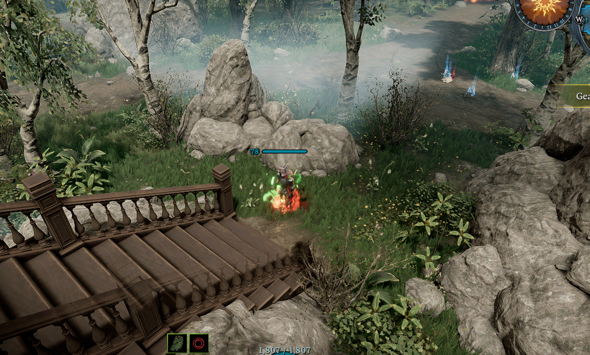
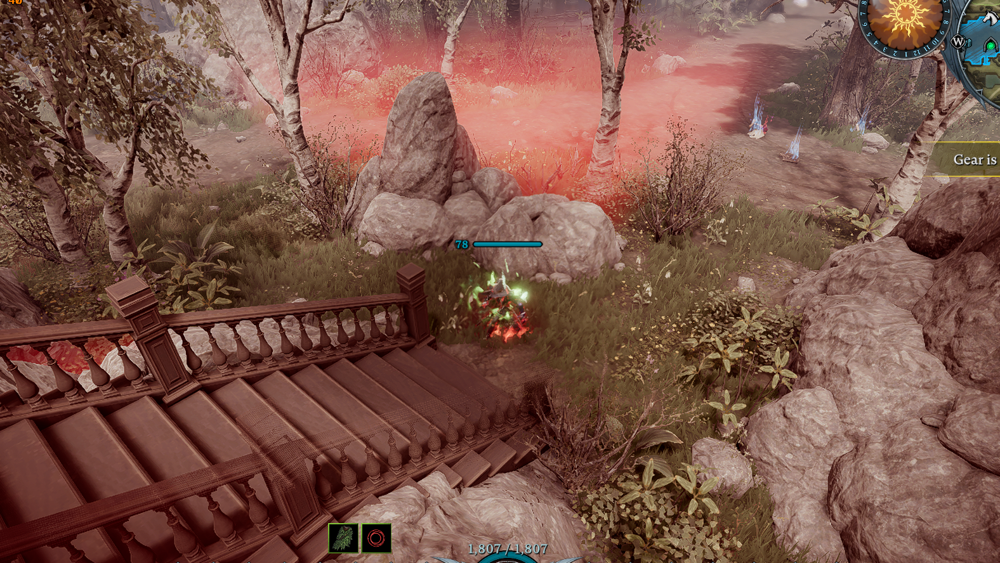

# NoBloodMoonTint — V Rising BepInEx Mod

Removes the blood moon's red screen tint, red fog, warm ambient cast, and sky glow while keeping the rest of the game fully intact. Toggle it on/off at any time and the screen returns to its exact pre-blood-moon state.

---

## Screenshots

| Blood Moon **ON** (vanilla) | Blood Moon **OFF** (mod active) |
|:--:|:--:|
|  |  |

---

## Features

- Suppresses the blood moon HDRP volume stack (ColorAdjustments, SplitToning, WhiteBalance) per-frame
- Kills the red volumetric fog (`StunlockFogVolumeComponent`) tied to blood moon profiles
- Neutralizes the `CustomVignette` full-screen red vignette pass
- Corrects warm ambient light to a neutral gray so blue/cool colors render correctly
- Applies a compensating brightness lift (`+0.50 EV`) on the baseline post-process profile so the scene stays visually bright
- Full state restore on toggle-off — nothing is permanently altered
- Session log written to `BepInEx/logs/NoBloodMoonTint.log`

---

## Keybinds

| Key | Action |
|-----|--------|
| `F7` | Toggle suppression on / off |
| `F6` | Scan and log all active scene volumes (diagnostic) |

Both keys are configurable in `BepInEx/config/NoBloodMoonTint.cfg`.

---

## Requirements

### Runtime

| Requirement | Notes |
|---|---|
| **V Rising** (Steam) | Tested on the current Steam release |
| **BepInEx 6 IL2CPP** (`6.0.0-be.1` or newer) | Must be the IL2CPP build, not the Mono build |

BepInEx IL2CPP for V Rising: https://builds.bepinex.dev/projects/bepinex_be

### Build-time (NuGet — restored automatically)

| Package | Version |
|---|---|
| `BepInEx.Core` | `6.0.0-be.1` |
| `BepInEx.Unity.IL2CPP` | `6.0.0-be.1` |
| `BepInEx.PluginInfoProps` | `2.1.0` |
| `HarmonyX` | `2.13.0` |

### Build-time (game interop assemblies)

These are generated by BepInEx's IL2CPP interop layer on first game launch and live inside your V Rising install. The project references them by path — update the `<HintPath>` entries in `NoBloodMoonTint.csproj` if your game is installed elsewhere.

| Assembly | Path (default) |
|---|---|
| `ProjectM.dll` | `VRising\BepInEx\interop\ProjectM.dll` |
| `ProjectM.Presentation.Systems.dll` | `VRising\BepInEx\interop\ProjectM.Presentation.Systems.dll` |
| `ProjectM.Camera.dll` | `VRising\BepInEx\interop\ProjectM.Camera.dll` |
| `UnityEngine.CoreModule.dll` | `VRising\BepInEx\interop\UnityEngine.CoreModule.dll` |
| `UnityEngine.InputLegacyModule.dll` | `VRising\BepInEx\interop\UnityEngine.InputLegacyModule.dll` |
| `Unity.RenderPipelines.Core.Runtime.dll` | `VRising\BepInEx\interop\Unity.RenderPipelines.Core.Runtime.dll` |
| `Unity.RenderPipelines.HighDefinition.Runtime.dll` | `VRising\BepInEx\interop\Unity.RenderPipelines.HighDefinition.Runtime.dll` |
| `Il2Cppmscorlib.dll` | `VRising\BepInEx\interop\Il2Cppmscorlib.dll` |

> **Interop assemblies are generated automatically** the first time you launch V Rising with BepInEx installed. If the `interop/` folder is empty, launch the game once and close it.

---

## Building

### Prerequisites

- [.NET 6 SDK](https://dotnet.microsoft.com/download/dotnet/6.0) (or newer)
- V Rising installed with BepInEx 6 IL2CPP (so the interop assemblies exist)

### Steps

```bash
# 1. Clone or download this repository
git clone <repo-url>
cd "BloodMoon Effect Off"

# 2. (Optional) Update game paths if V Rising is not on D:\Steam
#    Edit the <HintPath> entries in NoBloodMoonTint.csproj

# 3. Restore NuGet packages and build
dotnet build
```

The build output is at:
```
bin\Debug\net6.0\NoBloodMoonTint.dll
```

The post-build step automatically copies the DLL to:
```
D:\Steam\steamapps\common\VRising\BepInEx\plugins\NoBloodMoonTint.dll
```

If your game is installed elsewhere, update the `DestinationFolder` in the `MakeDeploy` target at the bottom of `NoBloodMoonTint.csproj`.

---

## Manual Installation (pre-built)

1. Install **BepInEx 6 IL2CPP** into your V Rising folder and launch the game once to generate interop assemblies.
2. Copy `NoBloodMoonTint.dll` into:
   ```
   VRising\BepInEx\plugins\
   ```
3. Launch V Rising. Press `F7` during a blood moon to toggle the visual effect off.

---

## Version History

| Version | Summary |
|---|---|
| 2.5.0 | Fix blue colors appearing darker — ambient now neutralizes to true gray |
| 2.4.0 | Brightness lift (+0.50 EV) on baseline profile to compensate suppression dimness |
| 2.3.0 | F7 toggle is now silent (no auto-scan) |
| 2.2.0 | Filter sound/music volume profiles from diagnostic log output |
| 2.1.0 | Suppress `CustomVignette` red fog pass; force blood moon fog component off |
| 2.0.0 | Stable release; minimal logging; F6 scan only |
